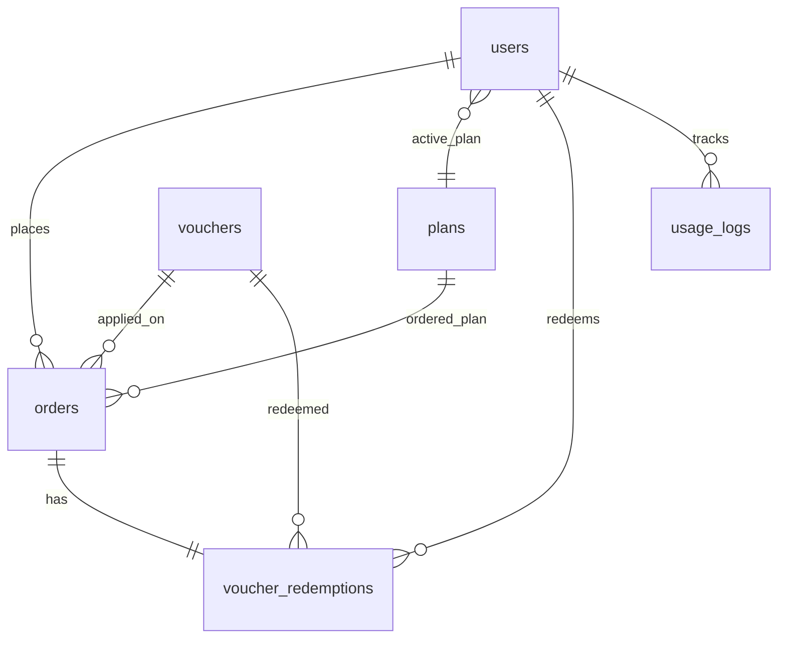
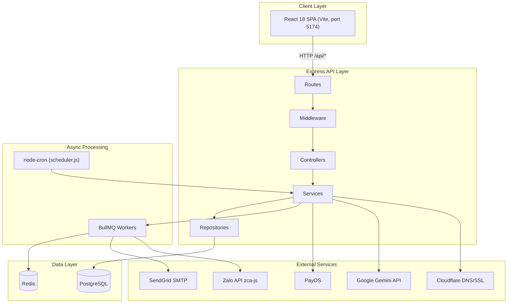

# FounderAI (UKNOW) — Số liệu dự án thật cho tài liệu / chuyên đề

> **Nguồn:** đo trực tiếp trên repo UKNOW Campaign (brand khách hàng: **Founder AI**, domain `*.founderai.biz`).
> **Stack:** Node.js + Express + PostgreSQL (monorepo: `frontend/` React 18 + Vite, `backend/` Express REST API).
> **Không phải** dự án .NET — đây là dự án production riêng.
> **Ngày đo:** 2026-07-10

---

## Mục lục

1. [API endpoints (route)](#1-api-endpoints-route)
2. [Test](#2-test)
3. [Cơ sở dữ liệu PostgreSQL](#3-cơ-sở-dữ-liệu-postgresql)
4. [Kiến trúc backend & luồng xử lý](#4-kiến-trúc-backend--luồng-xử-lý)
5. [Lệnh chạy test & output minh chứng](#5-lệnh-chạy-test--output-minh-chứng)

---

## 1. API endpoints (route)

### Phương pháp đếm

Đếm các khai báo `router.get|post|put|patch|delete|all(` trong `backend/src/routes/*.routes.js`.

**Lưu ý:** không đếm `router.use()` mount sub-router; chỉ đếm handler trực tiếp trên từng file route.

### Tổng quan

| Chỉ số | Giá trị |
|--------|---------|
| **Tổng endpoint** | **404** |
| **Số file route** | **58** |
| Thư mục | `backend/src/routes/` |
| Mount prefix | `backend/src/index.js` (ví dụ `/api/payment`, `/api/auth`, …) |

### Theo module nghiệp vụ

| Module | Endpoint | File route liên quan |
|--------|----------|----------------------|
| **Thanh toán / PayOS** | **24** | `payment.routes.js` (4), `plan.routes.js` (1), `voucher.routes.js` (3), `adminOrders.routes.js` (2), `adminPlans.routes.js` (10), `adminVouchers.routes.js` (4) |
| **Admin & RBAC** | **41** | `adminMembers.routes.js` (5), `adminAuditLogs.routes.js` (1), `adminSystem.routes.js` (2), `adminStats.routes.js` (1), `adminBulkNotification.routes.js` (2), `adminNotification.routes.js` (17), `employee.routes.js` (12), `audit.routes.js` (1) |
| **Xác thực người dùng** | **20** | `auth.routes.js` (9), `user.routes.js` (9), `verification.routes.js` (2) |
| **Trợ lý AI + Landing page** | **95** | `ai.routes.js` (29), `adminLandingPage.routes.js` (10), `adminLandingCustomizer.routes.js` (12), `adminLandingSection.routes.js` (8), `adminLandingFeaturedCourse.routes.js` (4), `adminLandingTestimonial.routes.js` (4), `landingTemplate.routes.js` (9), `lead.routes.js` (3), `leadPublic.routes.js` (1), `landingCmsPublic.routes.js` (7), `customDomain.routes.js` (8) |
| **Giám sát hệ thống** | **14** | `diagnostic.routes.js` (9), `adminDeliveryMonitor.routes.js` (1), `userDeliveryMonitor.routes.js` (1), `campaignRun.routes.js` (3) |
| **Các module khác** | **210** | campaign, chatbot, customer, email, zalo, webhook, products, … |

#### Ghi chú: AI sinh landing page

Endpoint **chuyên biệt** cho AI generate landing HTML:

```
POST /api/ai/generate-landing-html
```

- File: `backend/src/routes/ai.routes.js`
- Service: `backend/src/services/ai/aiLandingPage.service.js`
- Middleware: rate limit AI + kiểm tra AI credit (`assertAiCreditAvailable`)

Module "AI + Landing" rộng hơn (95 endpoint) bao gồm cả CMS landing, custom domain, lead capture, featured courses/testimonials.

#### Chi tiết module thanh toán / PayOS (4 endpoint trong `payment.routes.js`)

| Method | Path | Mô tả |
|--------|------|-------|
| POST | `/api/payment/create-payment` | Tạo đơn PayOS (auth required) |
| POST | `/api/payment/activate-free` | Kích hoạt gói miễn phí (auth required) |
| POST | `/api/payment/webhook` | Webhook xác nhận thanh toán từ PayOS |
| GET | `/api/payment/status/:orderCode` | Tra cứu trạng thái đơn |

### Liệt kê đầy đủ theo file route

```
adminAiModels.routes.js             3
adminAiUsage.routes.js              1
adminAuditLogs.routes.js            1
adminBulkNotification.routes.js     2
adminDeliveryMonitor.routes.js      1
adminLandingCustomizer.routes.js   12
adminLandingFeaturedCourse.routes.js 4
adminLandingPage.routes.js         10
adminLandingSection.routes.js       8
adminLandingTestimonial.routes.js   4
adminMembers.routes.js              5
adminNotification.routes.js        17
adminOrders.routes.js               2
adminPlans.routes.js               10
adminStats.routes.js                1
adminSystem.routes.js               2
adminVouchers.routes.js             4
ai.routes.js                       29
attachments.routes.js               2
audit.routes.js                     1
auth.routes.js                      9
campaign.routes.js                 11
campaignRun.routes.js               3
campaignSchedule.routes.js          5
chatbot.routes.js                  64
chatbotPublic.routes.js            11
contact.routes.js                   1
courses.routes.js                   3
customDomain.routes.js              8
customer.routes.js                 16
dashboard.routes.js                 9
diagnostic.routes.js                9
download.routes.js                  2
emailSettings.routes.js            11
emailTemplate.routes.js             5
employee.routes.js                 12
founderai.routes.js                 8
googleSheets.routes.js              2
landingCmsPublic.routes.js          7
landingTemplate.routes.js           9
lead.routes.js                      3
leadPublic.routes.js                1
payment.routes.js                   4
plan.routes.js                      1
products.routes.js                  6
public.routes.js                    4
publicPromotion.routes.js           1
templateLabel.routes.js             3
tracking.routes.js                  1
trackingShortLink.routes.js         1
upload.routes.js                    6
user.routes.js                      9
userDeliveryMonitor.routes.js       1
verification.routes.js              2
voucher.routes.js                   3
webhook.routes.js                  18
zaloSettings.routes.js             11
zaloTemplate.routes.js              5
────────────────────────────────────
TỔNG                              404
```

---

## 2. Test

### Backend — Jest

| Loại | Pattern file | Số file | Số `it()` / `test()` (static scan) |
|------|--------------|---------|-------------------------------------|
| **Unit** | `backend/src/**/__tests__/**/*.spec.js` | 39 | 335 |
| **Integration** | `backend/tests/integration/**/*.test.js` | 39 | ~778 |
| **Backend tổng** | — | **78** | **~1113** |

### Frontend & E2E (tham khảo)

| Loại | Framework | Số file | Số case |
|------|-----------|---------|---------|
| Frontend unit | **Vitest** | 2 | 14 |
| E2E | **Playwright** | 6 | 14 |

### Framework & hạ tầng

| Thành phần | Công nghệ |
|------------|-----------|
| Backend unit + integration | **Jest** (ESM, `--experimental-vm-modules`) |
| Frontend unit | **Vitest** |
| E2E | **Playwright** (`e2e/`) |
| Testcontainers | **Không dùng** |
| Integration DB | Postgres thật — DB test `uknow_campaign_test`, port **5433** (Docker e2e setup) |
| Bootstrap schema | `backend/tests/integration/sql/bootstrap.sql` |
| BullMQ trong test | `BULLMQ_ENABLED=false` (không cần Redis khi chạy test) |

### Cấu hình Jest (`backend/package.json`)

```json
"test:unit":        "jest --selectProjects=unit"
"test:integration": "jest --selectProjects=integration --runInBand --forceExit"
"test:all":         "jest --runInBand --forceExit"
```

---

## 3. Cơ sở dữ liệu PostgreSQL

### Nguồn schema

Gộp từ:
- `schema.sql` (root — **lỗi thời**, chỉ ~38 bảng)
- `backend/migrations/*.sql` (nguồn chính xác cho production)
- `backend/tests/integration/sql/bootstrap.sql`

| Chỉ số | Giá trị |
|--------|---------|
| **Tổng bảng (unique)** | **83** |

### Danh sách đầy đủ 83 bảng

```
ai_chat_messages
ai_chat_sessions
ai_models
audit_logs
business_profile_chunks
business_profiles
campaign_connections
campaign_customers
campaign_executions
campaign_nodes
campaign_participations
campaign_run_recipient_steps
campaign_runs
campaign_schedules
campaigns
channel_connections
channel_conversations
channel_messages
chatbot_channel_connections
chatbot_conversations
chatbot_messages
chatbot_settings
chatbot_studio_conversations
chatbot_studio_messages
chatbot_zalo_account_settings
contact_submissions
courses
custom_chatbot_chunks
custom_chatbots
custom_domain_ssl
custom_domain_verifications
custom_domains
customer_journey
customer_purchases
customers
dashboard_insights
diagnostic_messages
diagnostic_runs
email_messages
email_settings
email_templates
file_access_events
kb_chunks
kb_documents
knowledge_bases
landing_featured_courses
landing_page_domains
landing_page_events
landing_page_overrides
landing_page_sections
landing_page_templates
landing_pages
landing_testimonials
leads
login_history
notification_email_logs
notifications
orders
plans
products
refresh_tokens
schema_migrations
sub_assistants
template_files
template_labels
tracking_short_links
usage_logs
user_members
users
verification_codes
voucher_redemptions
vouchers
web_widget_configs
webchat_conversations
webchat_messages
zalo_accounts
zalo_groups
zalo_messages
zalo_personal_conversations
zalo_personal_messages
zalo_settings
zalo_templates
zalo_unreachable_phones
```

### Module thanh toán — bảng & quan hệ (ERD)

#### Bảng liên quan

| Bảng | Vai trò |
|------|---------|
| `plans` | Gói dịch vụ: giá, feature limits, `messages_per_period`, `max_chatbots`, `ai_credits_per_period`, … |
| `orders` | Đơn hàng: PayOS checkout, manual, voucher; trạng thái `pending/success/failed` |
| `vouchers` | Mã giảm giá (% hoặc số tiền cố định) |
| `voucher_redemptions` | Lịch sử đổi voucher gắn với order + user |
| `usage_logs` | Theo dõi usage theo kỳ billing (anti-spam / quota enforcement) |
| `users` | Cột `active_plan_id` → gói hiện tại của user |

> **Không có bảng `subscriptions` riêng.** Subscription được model qua `users.active_plan_id` + `orders.billing_period`.

#### Quan hệ FK (để vẽ ERD)

```
users.active_plan_id        → plans(id)
orders.plan_id              → plans(id)
orders.user_id              → users(id)
orders.voucher_id           → vouchers(id)
voucher_redemptions.voucher_id → vouchers(id)  ON DELETE CASCADE
voucher_redemptions.order_id   → orders(id)     ON DELETE CASCADE
voucher_redemptions.user_id    → users(id)
usage_logs.id_user          → users(id)
```

#### Mermaid ERD — module thanh toán



#### Luồng PayOS

```
Client POST /api/payment/create-payment
  → payment.controller → payment.service
  → Tạo order (status=pending) trong DB
  → Gọi PayOS API → trả QR/link checkout

PayOS POST /api/payment/webhook
  → Xác minh checksum
  → Cập nhật orders.status = success
  → Gán users.active_plan_id = orders.plan_id
  → (nếu có voucher) ghi voucher_redemptions
```

---

## 4. Kiến trúc backend & luồng xử lý

### Các tầng (layered architecture)

```
HTTP Request
  → Routes          (backend/src/routes/*.routes.js)
  → Middleware      (auth JWT, rate-limit, validation, AI credit, RBAC…)
  → Controllers     (backend/src/controllers/*.js)     — parse HTTP, trả response
  → Services        (backend/src/services/**)          — business logic, orchestration
  → Repositories    (backend/src/repositories/**)      — raw SQL
  → PostgreSQL      (pg pool — backend/src/config/database.js)
```

**Quy ước:** Routes không chứa SQL; Services không trả HTTP response trực tiếp.

### Vị trí BullMQ / Redis

| Queue | File service | Mục đích |
|-------|--------------|----------|
| Outbound messages | `services/queue/outboundMessageQueue.service.js` | Gửi email + Zalo (personal, group, friend request) async |
| KB documents | `services/chatbot/kbDocumentQueue.service.js` | Chunk + embed tài liệu knowledge base |

- Bật: `BULLMQ_ENABLED=true` + `BULLMQ_REDIS_URL=redis://127.0.0.1:6379`
- Worker registry: `services/queue/outboundMessageProcessorRegistry.js`
- Khởi động worker: `backend/src/index.js` (sau `initScheduler()`)
- Test: `BULLMQ_ENABLED=false` → gửi inline, không cần Redis

#### Luồng campaign có queue

```
Client POST /api/campaigns/run
  → campaignRun.routes → campaignRun.controller
  → campaignRun.service
  → campaignEmailSender / campaignZaloSender
       ├─ BULLMQ_ENABLED=true  → enqueue job → Redis/BullMQ worker
       │                            → SMTP (SendGrid) / Zalo API
       │                            → cập nhật campaign_runs ledger trong DB
       └─ BULLMQ_ENABLED=false → gửi inline (fallback đồng bộ)
```

### Vị trí node-cron

File: `backend/src/utils/scheduler.js`
Gọi từ: `initScheduler()` trong `backend/src/index.js` khi server start.

| Cron schedule | Việc làm |
|---------------|----------|
| `* * * * *` | Kiểm tra `campaign_schedules` — chạy campaign đã lên lịch |
| `*/5 * * * *` | Resume campaign sau quiet hours / rate limit pause |
| `*/15 * * * *` | Zalo session keep-alive |
| `30 0 * * *` | Reset daily send counters |
| `0 0 * * *` | Kiểm tra subscription/plan expiry |
| `0 8 * * *` | Gửi renewal reminders |
| (khác) | AI model sync, SSL custom domain provision, … |

### Sơ đồ kiến trúc tổng thể



### Các module chính (tham khảo)

| Module | Thư mục code chính |
|--------|-------------------|
| Auth & RBAC | `routes/auth.routes.js`, `employee.routes.js`; `features/auth`, `features/users` |
| Campaign | `services/campaign/`, `services/queue/`; `features/campaigns` |
| AI Chatbot / Studio | `services/chatbot/` (RAG, channel adapters, unified inbox) |
| AI Campaign Assistant | `services/ai/aiCampaign*.service.js`, `aiLandingPage.service.js` |
| Thanh toán | `services/payment/`, `payment.routes.js` |
| Landing pages | `services/landing*`, `customDomain.service.js` |
| Giám sát | `services/diagnostic/`, delivery monitor routes |

---

## 5. Lệnh chạy test & output minh chứng

### Yêu cầu môi trường integration test

- Postgres chạy trên port **5433** với DB `uknow_campaign_test`
- Xem `e2e/docker-compose.yml` hoặc README root để setup

### Lệnh

```bash
# Unit test (không cần DB)
cd backend && npm run test:unit

# Integration test (cần Postgres test DB)
cd backend && npm run test:integration

# Tất cả backend
cd backend && npm run test:all

# Frontend unit (Vitest)
cd frontend && npm run test

# E2E (Playwright)
cd e2e && npm test
```

### Output thực tế đã chạy (2026-07-10)

#### Unit test

```
Test Suites: 39 passed, 39 total
Tests:       335 passed, 335 total
Snapshots:   0 total
Time:        1.21 s
```

#### Integration test

```
Test Suites: 39 passed, 39 total
Tests:       2 skipped, 776 passed, 778 total
Snapshots:   0 total
Time:        180.513 s
```

#### Tất cả (unit + integration)

```
Test Suites: 78 passed, 78 total
Tests:       2 skipped, 1111 passed, 1113 total
Snapshots:   0 total
Time:        201.965 s
Ran all test suites in 2 projects.
```

---

## Phụ lục — Thông tin repo nhanh

| Mục | Giá trị |
|-----|---------|
| Frontend dev port | 5174 |
| Backend API port | 5001 |
| DB mặc định | `uknow-campaign` @ localhost:5432 |
| Plan tiers | trial, starter, basic, professional, enterprise |
| Payment gateway | PayOS (`@payos/node`) |
| AI model | Google Gemini (`GEMINI_MODEL=gemini-2.5-flash`) |
| Queue | BullMQ + Redis |
| Scheduler | node-cron |
| Kiến trúc doc | `backend/src/ARCHITECTURE_REFACTOR_MAP.md` |
| Hướng dẫn dev | `CLAUDE.md`, `AGENTS.md` (root) |

---

*Tài liệu này được tạo tự động từ phân tích codebase. Dùng làm input cho Claude AI khi viết báo cáo chuyên đề / tài liệu kỹ thuật.*
